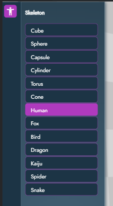
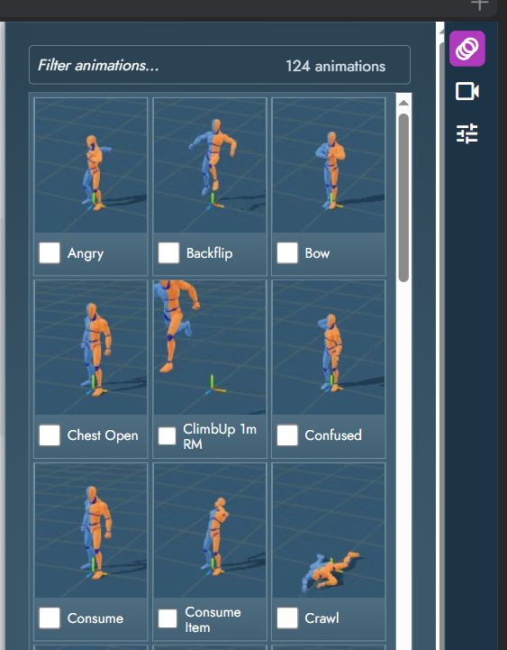
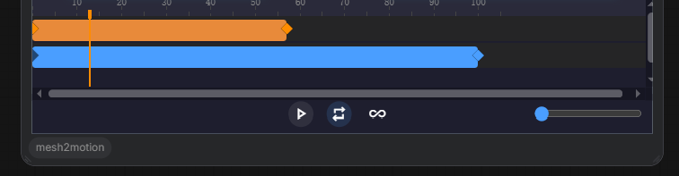

# ComfyUI-mesh2motion

A ComfyUI custom node that embeds a heavily-modified fork of
[Mesh2Motion](https://mesh2motion.org) as an interactive 3D editor
directly inside a node. Pick a rig, pick a camera move, tune the shot,
and the node emits an `IMAGE` (single frame) + `VIDEO` (rendered
camera move) that flow into the rest of your ComfyUI graph.

<!-- GitHub auto-plays <video> tags whose src points at a raw file in
     the same repo. Fall back to a direct link for renderers that don't. -->
<video src="docs/hero.mp4" controls muted loop playsinline width="100%"></video>

[▶ hero.mp4](docs/hero.mp4)

---

## What changed vs. upstream

This is a deep rework of the original plugin. If you used an earlier
version, expect the following:

- **One node, not many.** Everything routes through a single
  `Mesh2Motion Explore` node. Previous `Create`, `Preview`, `Save`
  variants are gone.
- **No right-click "Open in Mesh2Motion".** No top-menu button. No
  Vue-based dialog. The editor lives inside the node itself.
- **All UI moved into the iframe.** Skeleton picker, camera preset
  browser, tuning controls, timeline — every control the user needs
  is inside the embedded editor.
- **Full state persistence.** Everything the user picks or tunes is
  saved inside `node.properties`, so reloading the workflow restores
  the exact shot.
- **Video output is first-class.** The node outputs a `VIDEO`
  directly (webm decoded server-side via PyAV), no separate frame-list
  node needed.

---

## Installation

```bash
cd ComfyUI/custom_nodes
git clone https://github.com/jtydhr88/ComfyUI-mesh2motion.git
```

Restart ComfyUI. No extra Python dependencies — everything else is
either bundled or already in ComfyUI.

---

## The Mesh2Motion Explore node


### Widgets

| Widget | Type | Purpose |
|---|---|---|
| `show_skeleton` | bool | Draws the bone helper on top of the mesh |
| `mirror_animations` | bool | Mirrors the animation around the rig's symmetry plane |
| `preview_output` | bool | Overlays a crop rectangle matching `width`/`height` so you can see what'll actually be captured |
| `checker_room` | bool | Wraps the scene in a checkered room for more "AI-friendly" rendering |
| `width` / `height` | int | Output resolution for both IMAGE and VIDEO |
| `fps` | int | Frame rate written into the VIDEO (the timeline plays at the preset's native cadence; this only sets the encoded rate) |

### Outputs

| Output | When it's filled |
|---|---|
| `IMAGE` | Always — one screenshot of the viewport at the current playhead position |
| `VIDEO` | When a camera preset is active — a rendered webm of the whole camera move |

---

## Usage guide

### 1. Drop the node and open the editor

Add `Mesh2Motion Explore` from the node menu (category `3d/mesh2motion`).
The node renders an interactive 3D editor in place — no separate window
or modal.

### 2. Pick a skeleton (left side)



The left **activity bar** has a button that opens the **Skeleton** panel.
Two sections:

- **Primitives** — cube, sphere, capsule, cylinder, torus, cone. Useful
  for testing a camera path without loading a character, or for
  background elements.
- **Character rigs** — Human, Fox, Bird, Dragon etc. Each rig ships
  with a set of compatible animations.

Selecting a character loads its rig, its default mesh, and its animation
library (right panel → Animations).

### 3. Pick an animation (right side → Animations)



Opens via the right activity bar's first button. Animations are filtered
to the active skeleton type. Clicking one loads it into the mesh and
adds an animation track on the timeline.

### 4. Pick a camera preset (right side → Camera Presets)


Second button on the right activity bar. **116 presets** across 8
intent-based categories:

- **Basic Moves** — pans, slides, straight pushes/pulls, zooms
- **Cinematic** — dolly, crane, 360 track, J/L moves, Bird's Eye
- **Handheld** — handheld static/transitions, handheld zooms, subtle look-around
- **Speed Ramps** — dramatic accelerating moves (push/pull/twist)
- **Locomotion** — walking, running (forwards / backwards / sideways)
- **Vehicle** — car flybys, jet overpass, helicopter flyover, drone
- **Action** — missile strike, explosion, gunfire, flinch, fall
- **Abstract** — space cam floating, spinning, drunk

Clicking a preset immediately starts the camera move. Click **Free**
at the top to go back to free orbit controls (no preset active).

### 5. Tune the preset (right side → Camera Tuning)


Third button on the right activity bar. When a preset is active, the
panel shows the preset's metadata and a set of tuning controls.

**Metadata (read-only)**
- Preset name
- Duration (frames / seconds @ fps)
- Lens range — a ⚡ marker means the preset animates its lens mid-shot
  (Contra-Zoom / Dolly-Zoom class)

**Tuning controls**

| Control | What it does | Default |
|---|---|---|
| **Speed** | Playback speed multiplier (0.25× – 4×) | 1× |
| **FOV Scale** | Multiplies every frame's focal length; > 1 narrows FOV (zoom in) | 1× |
| **Path Scale** | Scales the whole camera path around the subject. < 1 = closer to subject, > 1 = further out. Baked rotations stay valid because the camera→subject direction is preserved | 1× |
| **Yaw** | Rotates the path around the vertical axis through the subject. Turns "dolly from the front" into "dolly from the side" | 0° |
| **Roll** | Dutch angle — rotates the camera around its own forward axis | 0° |
| **Offset (XYZ)** | Rigid world-space translation added to every frame's position (Three.js Y-up). Rotations are left untouched | (0, 0, 0) |
| **Reverse** | Play the preset backwards | off |
| **Loop** | Mirror of the timeline's loop toggle — kept in sync automatically | on |

Each control has an inline **↻** button that resets just that control.
The **Reset** button at the bottom clears everything.

Tuning is persisted **per preset** — picking the same preset later in
the same workflow restores the tuning you had.

### 6. Work with the timeline



- **Camera track (blue)** — the active preset's range. Right endpoint
  (solid blue) is draggable; drag it to change playback speed. Left
  endpoint (washed-out blue) is fixed at frame 0.
- **Animation track (orange)** — the active model animation. Drag the
  whole bar to shift the animation offset within the timeline. Drag
  the left or right endpoint to change speed.
- **Playhead** — drag across the timeline to scrub, or click anywhere
  to jump.

Playback bar below the timeline:

| Control | Purpose |
|---|---|
| ▶ / ❚❚ | Play / pause |
| 🔁 Timeline Loop | When the playhead hits the end of the camera range, restart from start. When off, playback pauses at the end |
| ♾ Model Anim Loop | When on, the animation keeps looping inside its range. The timeline visualization tiles the animation bar across the full camera length — solid orange for the authored cycle, washed-out orange for loop copies |
| Zoom slider | Zooms the timeline horizontally (also supported via Ctrl + wheel on the timeline) |

### 7. Set the output size and queue

Set `width`, `height`, `fps` on the node. Click Queue Prompt. The node
produces:

- `IMAGE` — a single frame at the current playhead
- `VIDEO` — the whole camera move, rendered off-screen at the target
  resolution using WebCodecs (deterministic, not bound by compositor
  frame pacing)

The video capture is cached: re-queuing without changing any input
that affects the captured frames short-circuits the render, so repeat
runs are instant.

---


## License

MIT

## Credits

- [Mesh2Motion](https://mesh2motion.org) by Scott Petrovic — the
  original 3D rigging and animation tool this plugin builds on
- [ComfyUI](https://github.com/comfyanonymous/ComfyUI) — the workflow
  platform
- [animation-timeline-js](https://github.com/ievgennaida/animation-timeline-control)
  — the canvas-based timeline widget
